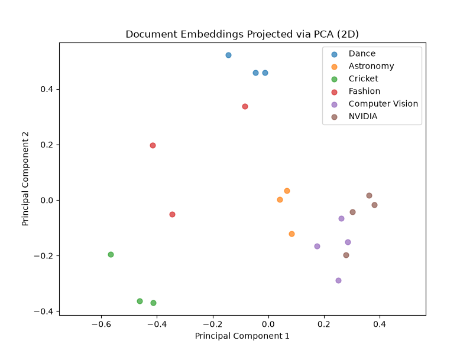

# Lab 3 — Semantic Search

A small semantic search engine over a 20-document corpus spanning 6 topics
(Dance, Astronomy, Cricket, Fashion, Computer Vision, NVIDIA). Documents are
embedded, searched by meaning using cosine similarity, and visualized in 2D
with PCA.

## What it does

- **`embeddings.py`** — gets an embedding for a piece of text, either via the
  NVIDIA NIM API (`nvidia/nv-embedqa-e5-v5`) or an offline hashed
  bag-of-words fallback (no key/network needed).
- **`search.py`** —
  - loads `documents.json` and builds an embedding matrix (cached to
    `embeddings_cache.json` so embeddings aren't re-fetched every run)
  - `search(query, embedding_matrix, documents, top_k)` — ranks documents by
    cosine similarity to the query
  - `pca_via_svd` + `plot_grid` — projects embeddings to 2D via SVD and
    scatter-plots them colored by topic

## Setup

```bash
pip install -r requirements.txt
cp .env.example .env   # add your NVIDIA_API_KEY if using API mode
```

## Running

**Offline mode (default, no API key needed):**
```bash
LAB3_EMBEDDING_MODE=offline python search.py
```

**API mode (real semantic embeddings, requires `NVIDIA_API_KEY` in `.env`):**
```bash
LAB3_EMBEDDING_MODE=api python search.py
```

This runs two example search queries and displays a PCA scatter plot of the
embedding space colored by topic.

## Notes

- Embeddings are cached in `embeddings_cache.json` after the first run; the
  cache is invalidated automatically if the corpus size changes.
- Offline mode matches on shared vocabulary, not true meaning, so its search
  results and PCA clusters are noticeably less clean than API mode's.

PCA Plot explanation



The projected embeddings via the PCA plot show two distinct clusters for topics Dance, Astronomy and Cricket. There is very less overlap between them in the real world as well. Computer Vision and NVIDIA have certain overlap, since both deal with AI/hardware content and share vocabulary. Fashion is a less defined cluster, which could be due to overlap in vocabulary from each of the other clusters. Overall, semantically distant topics separate cleanly, while conceptually related topics show partial overlap. 

